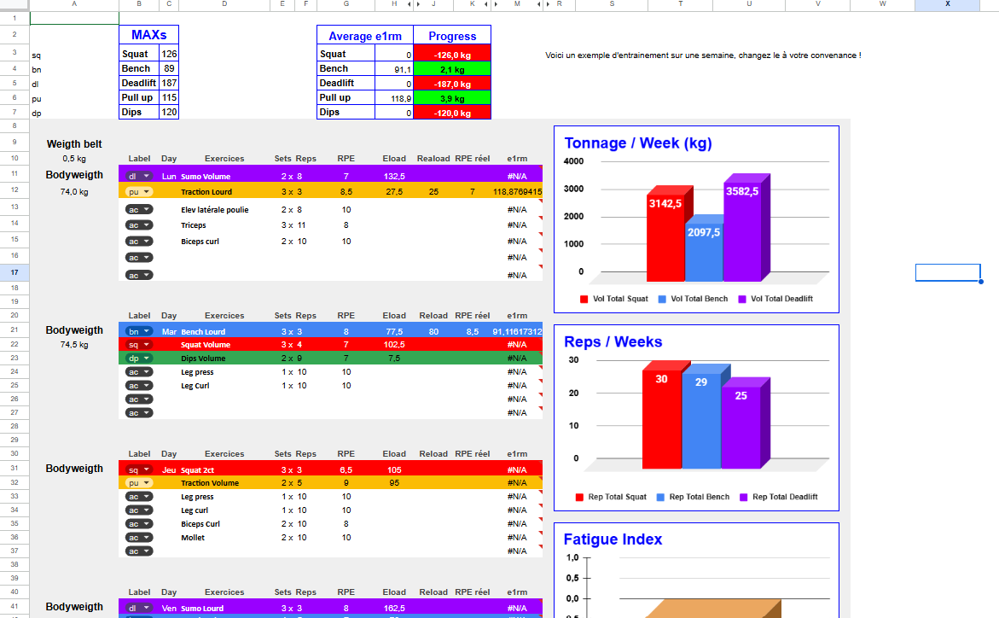

# 🏋️ PowerLift Tracker

[](https://www.google.com/sheets/about/)
[](Contributing.md)

An intelligent powerlifting tracking system built on Google Sheets, featuring automated e1RM calculations, progressive load management, and fatigue analysis.

[📖 User Guide (FR)](Guide_Utilisation_Fr.md) • [📖 User Guide (EN)](User_Guide_EN.md) • [🔗 Get the Template](https://docs.google.com/spreadsheets/d/1cMEQfgsgYV3C5RC8sq0Xvccz4UgO5aT8dhn19qVybdU/edit?usp=sharing) • [🐛 Report Bug](https://github.com/BnRomain/PowerLiftingTracker/issues)

---

## 📸 Preview



---

## 🎯 The Problem

As a powerlifter, I needed a tool to:
- **Plan sessions** with precision (loads, reps, RPE)
- **Track progression** on main movements (Squat, Bench Press, Deadlift)
- **Auto-adjust loads** based on actual performance
- **Detect accumulated fatigue** to optimize recovery

Existing apps lacked customization and didn't account for technical aspects like bodyweight for weighted exercises (pull-ups, dips).

---

## ✨ Key Features

### 📊 Automatic e1RM Calculation
- Based on **RPE Chart** (Rate of Perceived Exertion)
- Real-time calculation using: load, reps, and declared RPE
- Special handling for bodyweight exercises (Pull-ups, Dips) including bodyweight

### 🎯 Intelligent Load Planning
- Automatic **Eload** (planned load) calculation based on e1RM percentage
- Weekly reference adjustment based on actual performance
- Automatic rounding to 2.5 kg increments (Gym plate standard)

### 📈 Progression Tracking
- **Weekly average e1RM** for each main movement
- Week-to-week progress calculation (in kg and %)
- Total volume tracking (load × reps) per movement
- Total rep count per exercise

### 🔥 Fatigue Index
- Automatic calculation: `Actual RPE - Planned RPE`
- Weekly average to detect overtraining
- Visual indicators:
  - **Positive**: Accumulated fatigue
  - **Negative**: Good form
  - **~0**: According to plan

### ⚖️ Bodyweight Management
- Daily bodyweight tracking per session
- Automatic weekly average bodyweight calculation
- Integration in e1RM calculations for weighted exercises
- Smart display: only added weight shown, but calculation includes total weight

### 📉 Data Visualization
- e1RM evolution graphs over multiple weeks
- Fatigue index histogram per exercise
- Bodyweight evolution tracking
- Weekly tonnage and reps charts

---

## 🛠️ Technologies & Skills

### Advanced Google Sheets Formulas
- **ArrayFormula**: Matrix calculations for conditional averages
- **AVERAGEIF / AVERAGEIFS**: Averages with multiple criteria
- **Nested IF**: Complex conditional logic (up to 6 levels)
- **IFERROR**: Robust error handling (#N/A, division by zero)
- **ISNUMBER**: Numeric data validation

### Data Management
- Multi-sheet architecture: 1 week = 1 sheet
- Cross-sheet referencing for longitudinal tracking
- Dynamic handling of missing data (missed sessions)

### Data Visualization
- Column and line charts for trends
- Conditional formatting for visual indicators
- Clean and readable design

---

## 📋 Project Structure
```
PowerLift Tracker/
│
├── Week Sheets (1-10)
│   ├── Week Info
│   │   ├── Reference MAXs (Squat, Bench, Deadlift, Pull-ups, Dips)
│   │   ├── Average bodyweight
│   │   └── Calculated average e1RMs
│   │
│   ├── Session Planning (Mon, Tue, Thu, Fri, Sun)
│   │   ├── Exercise label
│   │   ├── Sets × Reps
│   │   ├── Planned RPE / Actual RPE
│   │   ├── Eload (planned load)
│   │   ├── Reload (actual load used)
│   │   ├── Calculated e1RM
│   │   └── Fatigue index
│   │
│   ├── Weekly Statistics
│   │   ├── Total volume per movement
│   │   ├── Total reps
│   │   └── Average fatigue index
│   │
│   └── Charts
│       ├── e1RM evolution
│       ├── Fatigue index
│       ├── Tonnage/Week
│       └── Reps/Week
│
└── "Suivi e1RM" Sheet
    └── Multi-week progression
        ├── Week | Date
        ├── Squat e1RM | Bench e1RM | Deadlift e1RM
        ├── Pull-ups e1RM | Dips e1RM
        ├── Total SBD chart
        ├── Pull-ups & Dips chart
        └── Bodyweight tracking chart
```

---

## 🔧 Key Formulas

### e1RM Calculation with Bodyweight Management
```excel
=IF(OR(B12="pu",B12="dp"),((J12+A12)*100)/L12,(J12*100)/L12)
```
- If Pull-up or Dips: adds bodyweight and weigth belt before calculation
- Otherwise: standard calculation with load only

### Weekly Average e1RM (Ignores Empty Cells)
```excel
=ROUND(ArrayFormula(IFERROR(AVERAGE(IF($B$11:$B$57="sq",
IF(ISNUMBER($M$11:$M$57),$M$11:$M$57))),"")),1)
```
- Filters by exercise label
- Ignores #N/A and empty cells
- Rounds to 1 decimal

### Fatigue Index
```excel
=IF(AND(K11<>"",ISNUMBER(K11)),K11-E11,"")
```
- Difference between actual RPE and planned RPE
- Handles empty cells

---

## 📊 Usage Example

**Monday - Deadlift Session**
1. My reference Deadlift e1RM: **190 kg**
2. Planned session: Sumo 2×8 @ RPE 7 (73.9% = **140 kg**)
3. I load **140 kg** (Eload calculated automatically)
4. I perform **2×8 @ 135 kg** (I went a bit lighter)
5. Actual RPE felt: **7** (according to plan)
6. Calculated e1RM: **182.6 kg** (based on 135kg × 8 reps @ RPE 7)
7. Fatigue index: **0** (7 - 7 = according to plan)

**End of Week**
- Calculated average Deadlift e1RM: **187.3 kg** (average of 2 DL sessions)
- This value automatically becomes the reference for next week

---

## 🚀 Getting Started

### Prerequisites
- Google account
- Basic understanding of powerlifting and RPE

### Installation

1. **Access the template**: [Google Sheets Template Link](https://docs.google.com/spreadsheets/d/1cMEQfgsgYV3C5RC8sq0Xvccz4UgO5aT8dhn19qVybdU/edit?usp=sharing)
2. **Make a copy**: File > Make a copy
3. **Fill in your current MAXs** in the "MAXs" section (cells C3-C7)
4. **Enter your bodyweight** in column A for each session
5. **Plan your week** by filling in sets, reps, planned RPE
6. **Record your performance**: load used, actual RPE
7. **Analyze**: e1RM, progression, fatigue index are calculated automatically

### Quick Start Guide
```
Week 1 Setup:
1. MAXs (C3-C7): Enter your current e1RMs
2. Bodyweight (A12, A22, etc.): Enter daily weight
3. Plan sessions: Label, exercise name, sets, reps, RPE
4. After training: Fill Reload (J) and Actual RPE (K)
5. Review: Check average e1RM and fatigue index

Week 2+:
→ MAXs automatically update from Week 1 average e1RMs
→ Repeat the process!
```

---

## 📖 Documentation

- **[Complete User Guide (French)](Guide_Utilisation_Fr.md)**: Detailed instructions in French
- **[Complete User Guide (English)](User_Guide_EN.md)**: Detailed instructions in English
- **[Contributing Guidelines](Contributing.md)**: How to contribute to this project
- **[Changelog](Changelog.md)**: Version history and updates

---

## 🎓 Learning Resources

### Understanding RPE
- [RPE in Powerlifting - Explained](https://www.strongerbyscience.com/autoregulation/)

### Powerlifting Programming
- [Programming Principles](https://www.powerliftingtowin.com/powerlifting-programs/)

---

## 🤝 Contributing

Contributions are welcome! Here's how you can help:

1. **Report bugs** via [GitHub Issues](https://github.com/BnRomain/PowerLiftingTracker/issues)
2. **Suggest features** you'd like to see
3. **Submit improvements** to formulas or layout
4. **Translate** the guide to other languages
5. **Share your results** and feedback

See [CONTRIBUTING.md](Contributing.md) for detailed guidelines.

---

## 📈 Roadmap

### Current Version: 1.0
- ✅ Core tracking functionality
- ✅ Automatic e1RM calculations
- ✅ Fatigue index
- ✅ 10-week progression tracking
- ✅ Bodyweight exercise support

### Future Enhancements
- [ ] Migration to React + Firebase web app
- [ ] Progress predictor ("You'll reach X kg in Y weeks")
- [ ] Comparison to strength standards (Beginner/Intermediate/Advanced/Elite)
- [ ] Auto-suggest deload based on fatigue threshold
- [ ] PDF export of weekly programs
- [ ] Mobile application
- [ ] Exercise video library integration
- [ ] Community leaderboards
- [ ] AI-powered form analysis

---

## 🏆 Success Stories

Want to share your progress? [Submit your story!](https://github.com/yourusername/powerlift-tracker/discussions)

---

## 📊 Statistics

- **10 weeks** of structured tracking
- **5 main movements** monitored (Squat, Bench, Deadlift, Pull-ups, Dips)
- **Automatic calculations** across 50+ formulas
- **Zero manual data transfer** between weeks

---

## 🙏 Acknowledgments

- **RPE Chart** methodology based on research by Mike Tuchscherer
- **Programming principles** inspired by Juggernaut Training Systems
- Thanks to all beta testers who helped refine the system

---

## 📧 Contact & Support

**Creator**: Romain Ben  
**Email**: romainben31@gmail.com  
**LinkedIn**: [romainben](https://www.linkedin.com/in/romainben/) 
**GitHub**: [@BnRomain](https://github.com/BnRomain)

For questions, suggestions, or collaboration:
- 💬 [Open a Discussion](https://github.com/BnRomain/PowerLiftingTracker/discussions)
- 🐛 [Report an Issue](https://github.com/BnRomain/PowerLiftingTracker/issues)
- ✉️ Email me directly

---

## ⭐ Show Your Support

If this project helped you track your powerlifting progress, please consider:
- ⭐ **Starring this repository**
- 🔄 **Sharing it** with your training partners
- 💬 **Leaving feedback** in Discussions
- 🤝 **Contributing** improvements

---

<div align="center">

**Built with ❤️ for the powerlifting community**

[Get Started](https://docs.google.com/spreadsheets/d/1cMEQfgsgYV3C5RC8sq0Xvccz4UgO5aT8dhn19qVybdU/edit?usp=sharing) • [Documentation](User_Guide_EN.md) • [Support]([#-contact--support](https://github.com/BnRomain/PowerLiftingTracker/discussions))

</div>
