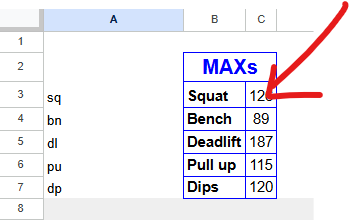
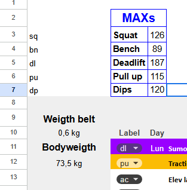
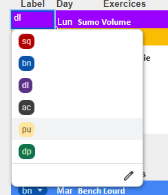
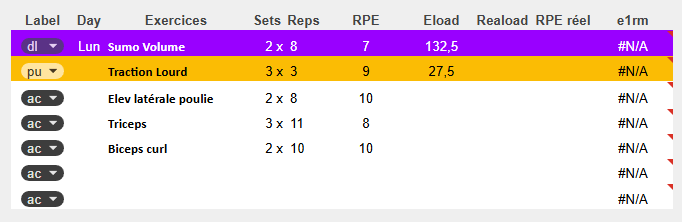
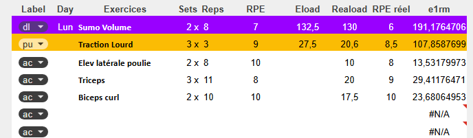
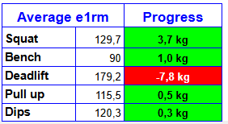
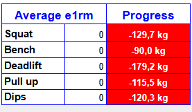

# 📘 USER GUIDE - POWERLIFT TRACKER

## 📋 Table of Contents

1. [Introduction](#1-introduction)
2. [Initial Setup](#2-initial-setup)
3. [Understanding the RPE Chart](#3-understanding-the-rpe-chart)
4. [Filling in a Session](#4-filling-in-a-session)
5. [Bodyweight Exercises](#5-bodyweight-exercises)
6. [Analyzing Your Performance](#6-analyzing-your-performance)
7. [Multi-Week Tracking](#7-multi-week-tracking)
8. [Important Rules](#8-important-rules)
9. [FAQ](#9-faq)

---

## 1. Introduction

Welcome to **PowerLift Tracker**! This system allows you to track your powerlifting progression in an intelligent and automated way.

**What the tool does:**
- Automatically calculates your e1RM (estimated 1 Rep Max)
- Adjusts your training loads based on your progression
- Analyzes your fatigue level
- Tracks your evolution over 10 weeks

---

## 2. Initial Setup

### Step 1: Fill in Your Current MAXs

In the **"MAXs"** section (cells **C3 to C7**), enter your reference e1RM for each main movement:

| Exercise | Cell | Example |
|----------|------|---------|
| Squat | C3 | 126 kg |
| Bench | C4 | 89 kg |
| Deadlift | C5 | 187 kg |
| Pull-ups | C6 | 115 kg |
| Dips | C7 | 120 kg |



**💡 Important:** 
- For Pull-ups and Dips, enter the **total weight** (your bodyweight + usual added weight)
- If you don't know your MAXs, estimate them conservatively

### Step 2: Fill in Your Bodyweight

Bodyweight is separate from MAXs and is filled in for each session. Remember to fill in your weight belt weight in A10.

#### Bodyweight per Session (Column A)

In column **A** (cells A12, A22, A32, A42, A52), enter your bodyweight for each training day:

| Session | Cell | Example |
|---------|------|---------|
| Monday | A12 | 73.5 kg |
| Tuesday | A22 | 73.9 kg |
| Thursday | A32 | 73.2 kg |
| Friday | A42 | 73.5 kg |
| Sunday | A52 | 74.2 kg |



**💡 Important Notes:**
- **Not mandatory to fill in all sessions**: The system calculates the average only on filled cells. If you only fill in 3 bodyweights out of 5 sessions, the average will be calculated on these 3 values.
- **No scale available?** You can enter an **estimate** of your daily weight. Even if it's less precise, it's more than adequate for Pull-ups and Dips calculations.

#### Average Weekly Bodyweight (A60)

- Calculated **automatically** from filled daily bodyweights
- Used as a general reference and for tracking your weight evolution
- Ignores empty cells

**Example:**
```
A12: 73.5 kg
A22: (empty - missed session)
A32: 73.2 kg
A42: 73.5 kg
A52: (empty - not weighed)
→ Average Bodyweight (C2) = (73.5 + 73.2 + 73.5) / 3 = 73.4 kg
```

---

## 3. Understanding the RPE Chart

### What is RPE?

**RPE** = Rate of Perceived Exertion

It's a scale from **5 to 10** that measures the difficulty of a set:

| RPE | Meaning | Reps in Reserve (RIR) |
|-----|---------|------------------------|
| 10 | Complete failure | 0 RIR |
| 9.5 | Almost failure | 0.5 RIR |
| 9 | 1 more rep possible | 1 RIR |
| 8.5 | 1-2 more reps | 1.5 RIR |
| 8 | 2 more reps | 2 RIR |
| 7.5 | 2-3 more reps | 2.5 RIR |
| 7 | 3 more reps | 3 RIR |
| 6.5 | 3-4 more reps | 3.5 RIR |
| 6 | 4 more reps | 4 RIR |
| 5.5 | 4-5 more reps | 4.5 RIR |
| 5 | 5+ more reps | 5 RIR |

### How Do We Use the RPE Chart?

The RPE Chart is located at the bottom of the sheet. It allows you to calculate your e1RM based on:
- The **weight** used
- The **number of repetitions** performed
- The **RPE** felt

**Example:**
- You do 3 reps at 110 kg with an RPE of 8
- In the RPE Chart: 3 reps @ RPE 8 = 83.7%
- Your e1RM = 110 / 0.837 = **131.4 kg**

⚠️ **You don't need to do this calculation manually, the sheet does it automatically!**

---

## 4. Filling in a Session

### Columns to Know

For each exercise, here are the important columns:

#### Columns to Fill BEFORE the Session (Planning)

| Column | Name | Description | Example |
|--------|------|-------------|---------|
| **B** | Label | Exercise type (sq/bn/dl/pu/dp/ac) | sq |
| **C** | Day | Day of the week (optional, just for visual reference) | Mon |
| **D** | Exercises | Exercise name | Squat Volume |
| **E** | Sets | Number of sets | 3 |
| **F** | Reps | Number of repetitions | 4 |
| **G** | RPE | Planned RPE | 7 |

**Note:** Column **C (Day)** only needs to be filled in on the first line of each session block to help you locate yourself. You can indicate the day of the week you're doing the session. It has no impact on calculations.

#### Columns Calculated Automatically (Visible)

| Column | Name | Description |
|--------|------|-------------|
| **H** | Eload | Planned load calculated according to your MAXs and RPE |
| **M** | e1RM | e1RM calculated after the session |

#### Columns to Fill AFTER the Session (Results)

| Column | Name | Description | Example |
|--------|------|-------------|---------|
| **J** | Reload | Actual weight used | 110 kg |
| **K** | Actual RPE | RPE felt after the set | 6 |

**Note:** For Pull-ups and Dips, see the dedicated section below.

#### Columns Calculated Automatically (Not Visible)

| Column | Name | Description |
|--------|------|-------------|
| **N** | Fatigue Index | Difference between Actual RPE - Planned RPE |
| **I** | Theoretical Intensity | Planned effort intensity |
| **L** | Actual Intensity | Performed effort intensity |
| **O,P,Q** | Session Info | Data collection for graphs |

### Labels (Column B)

| Label | Meaning | Use |
|-------|---------|-----|
| **sq** | Squat | Main squat movements |
| **bn** | Bench | Main bench press movements |
| **dl** | Deadlift | Main deadlift movements |
| **pu** | Pull-ups | Weighted pull-ups |
| **dp** | Dips | Weighted dips |
| **ac** | Accessories | Assistance exercises (not included in maxs --> no Eload) |

**⚠️ Important:** When you add an exercise to a session, it's up to you to choose which label the exercise belongs to.



The **Eload** (column H) is calculated **only** for labels **sq, bn, dl, pu, dp**. Accessory exercises (ac) don't have a calculated Eload. The goal is to track Power movements; if you add accessories, the e1RM calculation in column M will be done but there will be no tracking.

### Complete Filling Example

**Before the session (planning):**



**After the session (results):**



---

## 5. Bodyweight Exercises

### Pull-ups and Dips: Special Feature

For **Pull-ups (pu)** and **Dips (dp)**, the system takes into account your bodyweight and the weight of the belt in all calculations.

### How to Fill?

**📝 IMPORTANT RULE:**
- In the **Reload (J)** column: Note **ONLY the added weight** (weight on the belt)
- The system will **automatically add your bodyweight + belt weight** to calculate the e1RM

**Pull-ups Example:**
```
Bodyweight of the day (A12): 73.5 kg
Added weight on belt: 20 kg
Belt weight: 0.6 kg (for example)
→ In Reload (J12): Note 20 (just the added weight)
→ Calculated e1RM: Based on 94.1 kg (73.5 + 20 + 0.6)
```

### Why This Method?

This allows you to:
- ✅ Precisely track your absolute strength (body + added weight + belt)
- ✅ Automatically adjust if your weight changes
- ✅ Easily see the added weight to put on the belt (Eload displays just the net added weight)

### Complete Example

**Planning:**
- Pull-up total MAX (C6): 115 kg
- Planned session: 3×3 @ RPE 8.5 (87.8% = 101 kg total)
- Your weight today (A12): 73.5 kg
- **Calculated Eload: 27.5 kg** (101 - 73.5 - 0.6 = 26.9 kg added weight --> Rounded to 2.5 to match gym weights)

**Execution:**
- You put 27.5 kg on the belt
- Felt RPE: 8
- **Reload to note: 27.5** (just the added weight)
- **Calculated e1RM: 117.7 kg** (based on 26.25 + 73.5 + 0.6)


---

## 6. Analyzing Your Performance

### 6.1 Average e1RM

**Where to find it?** "Average e1rm" section at the top right of each week sheet (columns G and H)

**What it is:**
- The **average** of all calculated e1RMs in the week for each exercise
- **Automatically ignores** unfilled sessions or unperformed exercises
- **Automatically** becomes the reference (MAX) for the following week

**Example:**
```
Week 1:
- Squat session 1: e1RM = 135 kg
- Squat session 2: e1RM = 140 kg
- Squat session 3: Not performed (automatically ignored)
→ Average e1RM Squat = 137.5 kg

This value will AUTOMATICALLY be used as MAX (C3) for Week 2
```

**💡 Major Advantage:**
- **No need to manually copy-paste** values from one week to another
- MAXs update automatically based on your actual performance
- **Conservative** approach: the average smooths out variations and avoids overestimating your abilities

### 6.2 Progress Section

**Where to find it?** Column next to Average e1RM

**What it is:**
The difference between this week's average e1RM and the previous week's reference MAX.
Green if positive (Improvement) and red otherwise.



**Formula:** `Average e1RM - Reference MAX`

**Example:**
```
Squat MAX last week (C3): 135 kg
Average e1RM this week: 137.5 kg
→ Progress: +2.5 kg (+1.85%)
```

**Interpretation:**
- **Positive**: You're progressing ✅
- **Negative**: You're regressing (fatigue, deload, or bad week)
- **~0**: Maintaining level

⚠️ Only rely on it once the week is finished. Indeed, at the beginning of the week, you have announced MAXs of 130 kg for squat for example, but you haven't performed any squat exercise in your week yet. It then shows in the Progress section that you're at -130kg on squat which is absurd ;).



### 6.3 Fatigue Index

**Where to find it?**
Graph at the bottom right of the sheet called "Fatigue Index".

**Formula:** `Actual RPE - Planned RPE`

**Interpretation:**

| Index | Meaning | Action |
|-------|---------|--------|
| **< -1** | Excellent form | You can increase intensity |
| **-0.5 to +0.5** | Normal | Continue as planned |
| **+0.5 to +1** | Slight fatigue | Monitor your recovery |
| **> +1** | Significant fatigue | Consider a deload or more rest |

**Example:**
```
Planned RPE: 7
Actual RPE: 8.5
→ Index: +1.5 (significant fatigue)
```

**Weekly Average Index:**
```
Average of all your fatigue indices for the week
Example: -0.25 = Good overall form
```

### 6.4 Tonnage per Week

**Where to find it?**
Graph on the right of the sheet called "Tonnage/Week".

**What it is:**
The **tonnage** represents the total load volume lifted in the week for each main movement (Squat, Bench, Deadlift).

**Formula:** `Load × Repetitions × Sets` (for all exercises of the same type)

**Example:**
```
Squat session 1: 3 × 4 @ 110 kg = 1,320 kg
Squat session 2: 2 × 8 @ 100 kg = 1,600 kg
Squat session 3: 3 × 3 @ 120 kg = 1,080 kg
→ Total Squat tonnage: 4,000 kg
```

**Interpretation:**

| Observation | Meaning | Action |
|-------------|---------|--------|
| **Progressive increase** | Training volume increasing | Normal in progression |
| **Stagnation** | Stable volume | May indicate a plateau |
| **Sharp decrease** | Deload or recovery week | Normal if planned |
| **Sharp increase** | Sudden volume increase | Beware of overload risk |

**Use:**
- Track the evolution of your training volume
- Compare volume between movements (Squat vs Bench vs Deadlift)
- Detect overload or underload weeks
- Plan your deloads

---

### 6.5 Repetitions per Week

**Where to find it?**
Graph on the right of the sheet called "Reps/Week".

**What it is:**
The total number of repetitions performed in the week for each main movement (Squat, Bench, Deadlift).

**Formula:** `Sum of all repetitions` (for all exercises of the same type)

**Example:**
```
Squat session 1: 3 × 4 = 12 reps
Squat session 2: 2 × 8 = 16 reps
Squat session 3: 3 × 3 = 9 reps
→ Total Squat reps: 37 reps
```

**Interpretation:**

| Range | Training Type | Goal |
|-------|---------------|------|
| **< 20 reps** | Low volume, high intensity | Maximum strength |
| **20-40 reps** | Moderate volume | Strength and hypertrophy |
| **40-60 reps** | High volume | Hypertrophy |
| **> 60 reps** | Very high volume | Strength endurance |

**Use:**
- Verify that your repetition volume is consistent with your goals
- Balance volume between the 3 main movements
- Avoid imbalances (e.g., 60 reps of Bench vs 20 reps of Squat)
- Identify low volume weeks (deload) vs high intensity

**💡 Tip:**
For powerlifting, a balanced ratio could be:
- **Squat: 30-50 reps/week**
- **Bench: 25-45 reps/week**
- **Deadlift: 15-30 reps/week** (often lower volume as it's more taxing)

---

## 7. Multi-Week Tracking

### 7.1 Sheet Structure

The file contains **10 week sheets** named:
- Week 1
- Week 2
- Week 3
- ...
- Week 10

### 7.2 "Suivi e1RM" Sheet

**⚠️ CRITICAL RULE: DO NOT RENAME THE WEEK SHEETS**

The "Suivi e1RM" sheet automatically retrieves data from each week via reference formulas.

**If you rename a sheet, tracking will no longer work!**

### What "Suivi e1RM" Contains

#### Progress Table (Hidden but visible if you move the graphs)

| Week | Date | Squat | Bench | Deadlift | Pull-ups | Dips |
|------|------|-------|-------|----------|----------|------|
| 1 | 01/06/26 | 135 | 90 | 190 | 100 | 85 |
| 2 | 01/13/26 | 137.5 | 92 | 197.5 | 103 | 87.5 |
| ... | ... | ... | ... | ... | ... | ... |

#### "Total SBD" Graph
- **Squat MAX**: Average Squat e1RM for the week
- **Bench MAX**: Average Bench e1RM for the week
- **Deadlift MAX**: Average Deadlift e1RM for the week
- **Total SBD**: Sum of the 3 main maxs (Squat + Bench + Deadlift)
- Allows tracking your overall powerlifting total

#### "Pull-ups & Dips MAX" Graph
- **Pull-ups MAX**: Average Pull-ups e1RM for the week (total weight)
- **Dips MAX**: Average Dips e1RM for the week (total weight)

#### Weight Tracking
- **Average Bodyweight**: Weekly average bodyweight
- Evolution graph over 10 weeks

### How to Use It

1. **Each week**: Fill in your week sheet normally
2. **Data synchronizes automatically** in "Suivi e1RM"
3. **The following week's MAXs update automatically** based on your Average e1RM
4. **Check your graphs** to visualize your overall progress

---

## 8. Important Rules

### ✅ TO DO

- ✅ Fill in your bodyweight and weight belt (column A) at the start of each session
- ✅ Use correct labels for exercises (sq/bn/dl/pu/dp/ac)
- ✅ Note the actual RPE (column K) after each important set as well as the Reload (column J)
- ✅ For pull-ups/dips: note **only the added weight** in Reload (column J)
- ✅ Let the system automatically transfer Average e1RM to the following week's MAXs

### ❌ NOT TO DO

- ❌ **NEVER** rename the week sheets (breaks tracking)
- ❌ Don't modify formulas in calculated columns
- ❌ Don't put the total weight (body + added weight) for pull-ups/dips in Reload
- ❌ Don't leave bodyweight cells empty if you're doing pu/dp that day, otherwise no correct e1RM calculation
- ❌ Don't manually copy-paste MAXs from one week to another (it's automatic!)

### 🔧 Automatic Operation

**MAX Transfer Between Weeks:**

The system works in a **completely automatic** way:

1. You fill in your Week 1 sessions
2. Average e1RMs are calculated automatically
3. These values **automatically** become the MAXs (C3-C7) for Week 2
4. You have **nothing to copy-paste** manually

**Advantage:**
- **Conservative** approach: using the average of actual performances avoids overestimating your abilities
- **Time-saving**: no manual manipulation
- **Consistency**: ensures your loads are always based on your recent performances

---

## 9. FAQ

### Q1: I missed a session, what should I do?

**A:** Simply leave the lines empty. The system automatically ignores missing data and calculates averages only on completed sessions.

### Q2: My calculated e1RM seems too high/low

**A:** Check that:
- You noted the correct RPE
- The weight in Reload is correct
- For pu/dp: you noted only the added weight (not the total) and filled in the session bodyweight cell

### Q3: Can I add exercises?

**A:** Yes! Use the **"ac"** label (accessories). These exercises won't calculate e1RM or Eload but will be tracked.

### Q4: How do I interpret a negative fatigue index?

**A:** It's positive! It means the set was easier than expected. You're in good form.

### Q5: The graphs aren't updating

**A:** Check that:
- Week sheets haven't been renamed
- Formulas in "Suivi e1RM" point to the correct cells
- Data is properly filled in the week sheets

### Q6: Should I fill in my bodyweight if I'm not doing pu/dp?

**A:** It's recommended for general weight tracking, but it's not mandatory for calculations of other exercises (sq/bn/dl).

### Q7: What do I do once I've finished the 10 weeks?

**A:** Create a copy of the Google Sheet you just finished. For this copy, remember to delete all your Reload and Actual RPE from all weeks. Fill in your new MAXs (which you can see in the old one) in Week 1. And off you go again!

### Q8: Should I copy my Average e1RM to the following week's MAXs?

**A:** **No!** It's automatic. The system automatically transfers your Average e1RM as MAXs for the following week. You don't need to do anything.

### Q9: Why use the average rather than the best e1RM of the week?

**A:** The average approach is more **conservative** and **realistic**:
- Smooths out day-to-day variations (sleep, stress, nutrition)
- Avoids basing your loads on an isolated exceptional performance
- Ensures sustainable and safe progression

### Q10: Should the "Day" column (C) be filled everywhere?

**A:** No, it's optional. You can fill it only on the first line of each session block to visually locate yourself. It has no impact on calculations.

### Q11: Can I change my training sessions in the middle of the 10 weeks?

**A:** Absolutely, you can change them as much as you want.

---

## 📧 Support

For any questions or suggestions:
- Email: romainben31@gmail.com
- GitHub Issues: [link to issues]

---

**Happy training! 💪**
